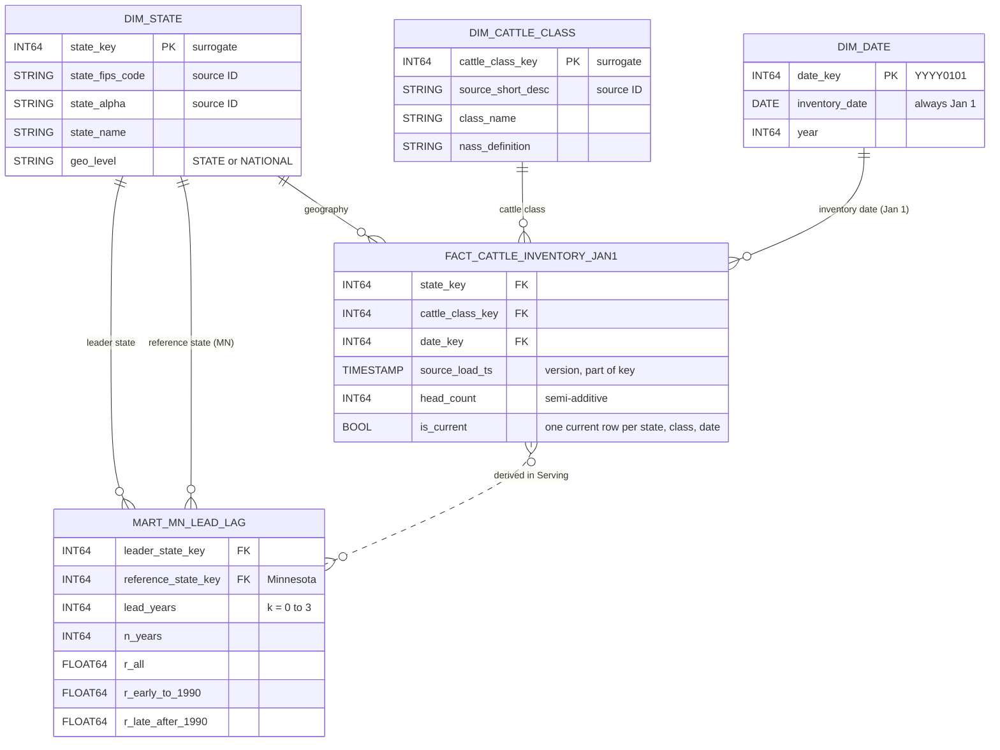

```mermaid
erDiagram
    DIM_STATE ||--o{ FACT_CATTLE_INVENTORY_JAN1 : "geography"
    DIM_CATTLE_CLASS ||--o{ FACT_CATTLE_INVENTORY_JAN1 : "cattle class"
    DIM_DATE ||--o{ FACT_CATTLE_INVENTORY_JAN1 : "inventory date (Jan 1)"
    DIM_STATE ||--o{ MART_MN_LEAD_LAG : "leader state"
    DIM_STATE ||--o{ MART_MN_LEAD_LAG : "reference state (MN)"
    FACT_CATTLE_INVENTORY_JAN1 }o..o{ MART_MN_LEAD_LAG : "derived in Serving"

    FACT_CATTLE_INVENTORY_JAN1 {
        INT64 state_key FK
        INT64 cattle_class_key FK
        INT64 date_key FK
        TIMESTAMP source_load_ts "version, part of key"
        INT64 head_count "semi-additive"
        BOOL is_current "one current row per state, class, date"
    }
    DIM_STATE {
        INT64 state_key PK "surrogate"
        STRING state_fips_code "source ID"
        STRING state_alpha "source ID"
        STRING state_name
        STRING geo_level "STATE or NATIONAL"
    }
    DIM_CATTLE_CLASS {
        INT64 cattle_class_key PK "surrogate"
        STRING source_short_desc "source ID"
        STRING class_name
        STRING nass_definition
    }
    DIM_DATE {
        INT64 date_key PK "YYYY0101"
        DATE inventory_date "always Jan 1"
        INT64 year
    }
    MART_MN_LEAD_LAG {
        INT64 leader_state_key FK
        INT64 reference_state_key FK "Minnesota"
        INT64 lead_years "k = 0 to 3"
        INT64 n_years
        FLOAT64 r_all
        FLOAT64 r_early_to_1990
        FLOAT64 r_late_after_1990
    }
```
